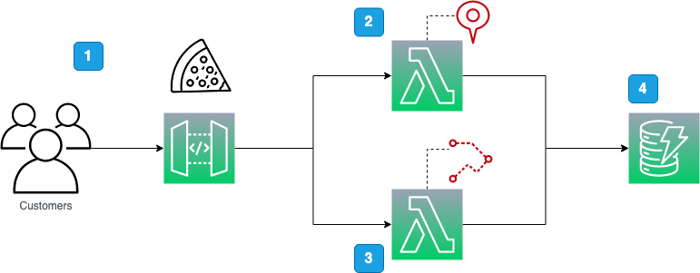

# Serverless Location Services

An example of using Amazon Location Services to supplement customer address data with geospatial information; with examples written in TypeScript and the AWS CDK.

The article for this repo can be found here: https://blog.serverlessadvocate.com/serverless-amazon-location-service-19a6029f5c0

We will be building out the following basic architecture:

1. Customers can create a new account with the restaurant.

2. We use a Place Index to calculate the coordinates based on the customer's postcode and store the results in DynamoDB alongside their customer account record.

3. Subsequently, a customer can place a food order for delivery, and we use the Route Calculator to calculate the estimated delivery time and distance between their address and the restaurant.

4. All customer and order records are stored in Amazon DynamoDB.

## Deploying

To deploy the solution cd into the folder `'lees-grill'` and run `npm run deploy`

## Tear Down

To tear down the solution please run `npm run remove`.

---

** The information provided are my own personal views and I accept no responsibility on the use of the information. **
